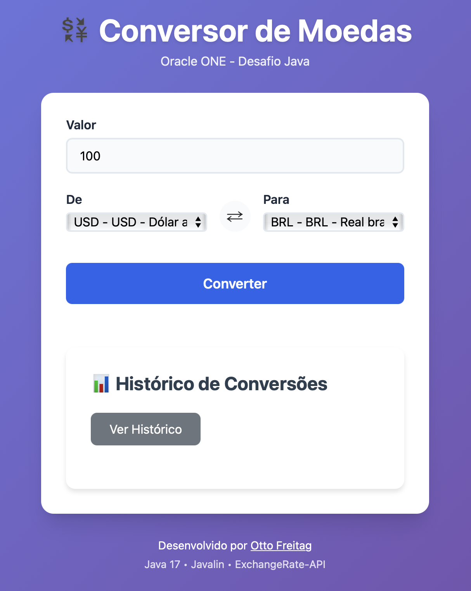
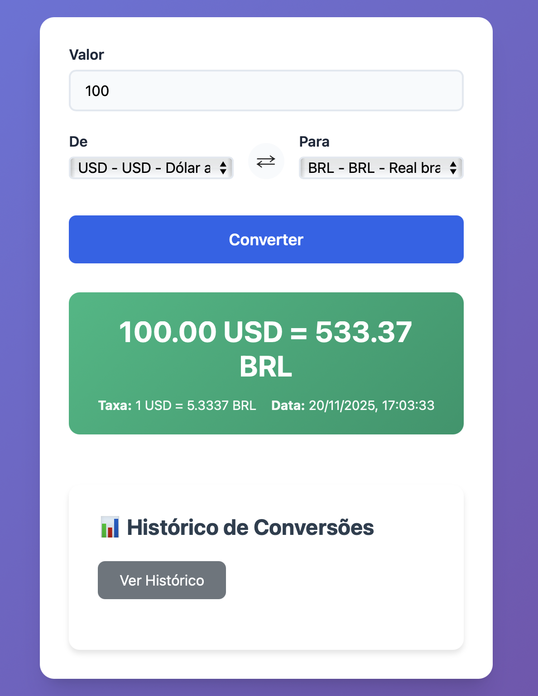
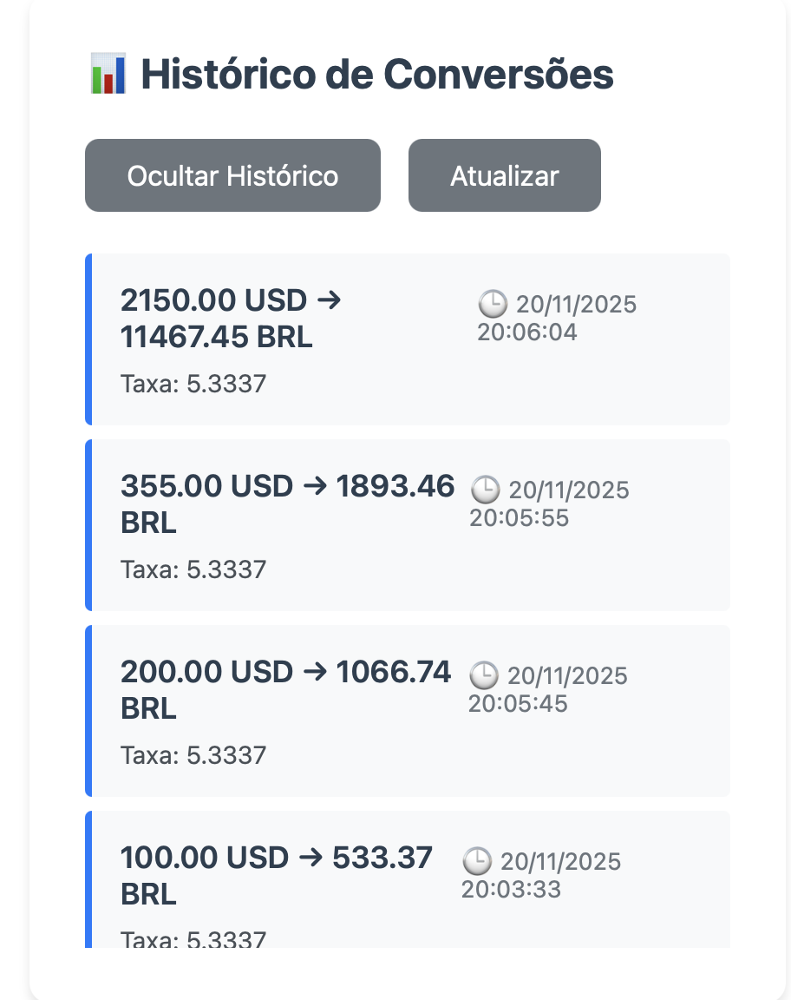

# 🎨 Conversor de Moedas - Frontend

> Interface web responsiva para o Conversor de Moedas Oracle ONE

[](https://ottof77.github.io/conversor-moedas-frontend)
[](https://developer.mozilla.org/en-US/docs/Web/HTML)
[](https://developer.mozilla.org/en-US/docs/Web/CSS)
[](https://developer.mozilla.org/en-US/docs/Web/JavaScript)

## 🌐 Demo ao Vivo

**🔗 URL:** https://ottof77.github.io/conversor-moedas-frontend

## 📱 Sobre

Frontend estático para o **Conversor de Moedas** desenvolvido para o desafio Oracle ONE.

- 🎨 **Design moderno** e responsivo (mobile-first)
- ⚡ **SPA (Single Page Application)** sem frameworks
- 🔄 **Botão swap** para inverter moedas rapidamente
- 💬 **Feedback visual** de loading, erro e sucesso
- 📱 **Funciona em qualquer dispositivo** (desktop, tablet, mobile)

## 🏗️ Tecnologias

- **HTML5** — Estrutura semântica
- **CSS3** — Gradientes, flexbox, animações
- **JavaScript Vanilla** — Fetch API, manipulação DOM
- **GitHub Pages** — Hospedagem gratuita

## 🔌 Backend

Este frontend consome a API REST hospedada no Render:

**🔗 Backend:** https://conversor-moedas-api.onrender.com

**📦 Repositório do Backend:** https://github.com/OttoF77/conversor-moedas

## ⚙️ Configuração

### URL da API

A URL do backend está configurada no arquivo `script.js`:

```javascript
// Linha 2
const API_BASE_URL = 'https://conversor-moedas-api.onrender.com';
```

**Para ambiente local:**
```javascript
const API_BASE_URL = 'http://localhost:7000';
```

## 🚀 Deploy no GitHub Pages

### Passo a Passo:

1. **Fork ou Clone este repositório**

2. **Vá em Settings do repositório**
   - Settings → Pages

3. **Configure a Source:**
   - **Source:** Deploy from a branch
   - **Branch:** `main` / `(root)`
   - **Save**

4. **Aguarde 1-2 minutos**
   - GitHub Actions irá fazer o build

5. **Acesse a URL gerada:**
   ```
   https://SEU_USUARIO.github.io/conversor-moedas-frontend
   ```

## 📂 Estrutura de Arquivos

```
conversor-moedas-frontend/
├── index.html       # Página principal
├── style.css        # Estilos (gradientes, responsivo)
├── script.js        # Lógica (API calls, validação)
└── README.md        # Este arquivo
```

## 🎯 Funcionalidades

- ✅ **Conversão em tempo real** via API REST
- ✅ **6 moedas suportadas:** BRL, USD, ARS, CLP, COP, BOB
- ✅ **Validação de entrada** (valores positivos, códigos válidos)
- ✅ **Loading state** durante requisições
- ✅ **Tratamento de erros** com mensagens amigáveis
- ✅ **Aviso de cold start** (Render free tier)
- ✅ **Design responsivo** (mobile-first)

## 🎨 Capturas de Tela

### Desktop
Interface limpa com gradiente roxo e campos bem espaçados.

### Mobile
Layout adaptado para telas pequenas, botões acessíveis.

### Exemplos de Uso

| Visualização Inicial | Convertendo Moedas | Histórico de Conversões |
|----------------------|--------------------|--------------------------|
|  |  |  |


## 🔧 Desenvolvimento Local

### Opção 1: Live Server (VS Code)

1. Instale a extensão **Live Server**
2. Clique direito em `index.html` → **Open with Live Server**
3. Abre em `http://localhost:5500`

### Opção 2: Python SimpleHTTPServer

```bash
# Python 3
python3 -m http.server 8000

# Acesse: http://localhost:8000
```

### Opção 3: Node.js http-server

```bash
npx http-server -p 8000

# Acesse: http://localhost:8000
```

## ⚠️ Nota sobre o Backend (Render Free Tier)

O backend no Render (plano gratuito) **"dorme" após 15 minutos sem requisições**.

**Primeiro acesso:**
- ⏱️ Pode demorar ~30-60 segundos
- 💤 Servidor está "acordando"
- ⚡ Requisições seguintes são instantâneas

**O frontend já mostra aviso automático!**

## 🤝 Contribuindo

Este é um projeto educacional. Sugestões são bem-vindas!

1. Fork o projeto
2. Crie uma branch (`git checkout -b feature/minha-feature`)
3. Commit suas mudanças (`git commit -m 'Adiciona feature X'`)
4. Push para a branch (`git push origin feature/minha-feature`)
5. Abra um Pull Request

## 📄 Licença

Projeto educacional desenvolvido para o programa **Oracle Next Education (ONE)**.

## 🔗 Links

- 🔌 **Backend (API):** https://github.com/OttoF77/conversor-moedas
- 🌐 **Frontend Live:** https://ottof77.github.io/conversor-moedas-frontend
- 👨‍💻 **Autor:** [Otto Freitag](https://github.com/OttoF77)
- 🎓 **Programa:** Oracle ONE + Alura

---

<div align="center">

**⭐ Se este projeto te ajudou, deixe uma estrela! ⭐**

Made with 💜 and ☕ by [Otto Freitag](https://github.com/OttoF77)

</div>
